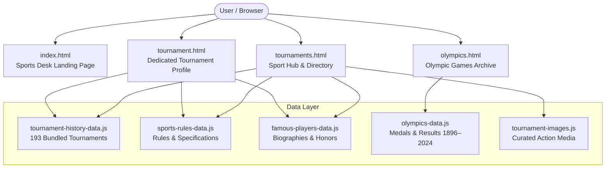

# Sideline — All-Sports Desk & Tournament Directory

> **An editorial-grade, ultra-responsive, zero-dependency sports encyclopedia, tournament directory, and historical archive spanning 20 sports, 193 global competitions, and modern Olympic history.**

---

## 📌 Table of Contents
1. [Problem Statement](#-problem-statement)
2. [Project Overview & Solution](#-project-overview--solution)
3. [Key Features & Capabilities](#-key-features--capabilities)
4. [Complete File & Directory Structure](#-complete-file--directory-structure)
5. [Architecture & Technical Implementation](#-architecture--technical-implementation)
6. [Supported Sports & Tournaments (20 Sports / 193 Competitions)](#-supported-sports--tournaments)
7. [Data Architecture & Bundling Strategy](#-data-architecture--bundling-strategy)
8. [Getting Started & Local Execution](#-getting-started--local-execution)
9. [Automation & Maintenance Scripts](#-automation--maintenance-scripts)
10. [Design System & Typography](#-design-system--typography)
11. [License & Acknowledgments](#-license--acknowledgments)

---

## 🚨 Problem Statement

Sports enthusiasts, researchers, journalists, and everyday sports followers encounter several persistent barriers when exploring international athletics and competition history:

1. **Severe Data Fragmentation Across Siloed Federations**:
   To find official rules, historical champion rolls, and tournament structures, fans must navigate dozens of disparate, non-standardized federation portals (e.g., FIFA, ICC, ATP, FIBA, BWF, FIH, UCI, World Athletics, FIDE, UWW). These portals often feature broken archives, unintuitive navigation, and heavy commercial ads.

2. **Underrepresentation of Traditional & Non-Western Sports**:
   Mainstream sports media (ESPN, Sky Sports, BBC Sport) focus heavily on a handful of commercial leagues (Premier League, NFL, NBA, Formula 1). Sports commanding hundreds of millions of passionate fans across Asia and the Global South—such as **Kho-kho, Kabaddi, Badminton, and Table Tennis**—are frequently sidelined without structured digital archives or rulebooks.

3. **Absence of Historical Context & Specifications in Live Apps**:
   Modern sports apps prioritize fleeting live scores and sensationalized transfer rumors. They rarely provide deep-dive tournament specifications (court dimensions, playing surface, trophy names, founding dates, qualification pathways), official sport rules, or career milestones for sports legends.

4. **Technical Fragility & High Latency in Modern Web Apps**:
   Many web apps rely on fragile third-party REST APIs that impose rate limits, paywalls, and cross-origin (CORS) restrictions. Running sports web apps locally or in offline environments typically fails without complex server orchestration or API keys.

---

## 💡 Project Overview & Solution

**Sideline** is an editorial-grade, client-side sports desk built with semantic HTML5, modern vanilla CSS, and modular vanilla JavaScript. It delivers an encyclopedic digital archive with **zero external framework dependencies** and **100% offline / `file:///` protocol compatibility**.



Sideline solves sports fragmentation by offering:
- **Comprehensive Multi-Sport Parity**: 20 distinct sports treated with equal depth—from Football and Cricket to Kho-kho and Kabaddi.
- **Deep Championship Archives**: 193 tournaments featuring source-verified champion rosters, runners-up, scorelines, winning margins, and historical notes.
- **Rules & Technical Specifications**: Field/court diagrams, playing area dimensions, scoring systems, violations, and tournament-specific regulations.
- **Hall of Fame & Legends Explorer**: Interactive career profiles, milestone badges, and biographies for the greatest athletes across all 20 disciplines.
- **Interactive Olympic Games Portal**: Complete Summer Olympic records from Athens 1896 to Paris 2024, including all-time medal rankings, nation search, discipline podium results, and Olympic movement milestones.
- **Instant Client-Side Execution**: Pre-bundled dataset architecture allows the entire application to load instantly without CORS errors, even when double-clicked directly from the local file system.

---

## ⚡ Key Features & Capabilities

| Feature | Description |
| :--- | :--- |
| **All-Sports Desk (Landing Page)** | High-impact magazine layout with 20 visual sport tiles, quick search with `/` keyboard shortcut, and curated links. |
| **Sport Hub & Directory** | Horizontal sport-switcher carousel, 3-tab unified hub (*Tournaments*, *Official Sport Rules*, *Famous Legends*), and category filter chips. |
| **Grid & List Display Modes** | Dynamic view switcher enabling users to toggle between rich magazine cards and high-density tabular list views. |
| **Dedicated Tournament Profiles** | Granular detail page with tournament specifications (host country, trophy, surfaces, format), regulations tab, and source links. |
| **Instant Results Modal Dialog** | Native `<dialog>` modal enabling users to view full championship histories without losing their place on directory pages. |
| **Hall of Fame Dialogs** | Interactive player dialog with biographical background, era, playing position/role, and major career milestones. |
| **Olympic Games Archive** | Complete edition picker (Paris 2024, Tokyo 2020, Rio 2016, London 2012, Beijing 2008, Sydney 2000...), medal tallies, and podium results. |
| **Zero-CORS Architecture** | 100% functional via both `file:///` and HTTP web servers via pre-bundled in-memory JavaScript data models. |

---

## 📂 Complete File & Directory Structure

```text
d:\frontend-projects\project-2/
│
├── .github/
│   └── agents/
│       └── sideline-frontend.agent.md        # AI Agent specifications & frontend development rules
│
├── data/
│   ├── olympics_cache/                       # Raw source HTML caches for Olympic Games editions
│   │   ├── 2000_Summer_Olympics_medal_table.html
│   │   ├── 2008_Summer_Olympics_medal_table.html
│   │   ├── 2012_Summer_Olympics_medal_table.html
│   │   ├── 2016_Summer_Olympics_medal_table.html
│   │   ├── 2020_Summer_Olympics_medal_table.html
│   │   ├── 2024_Summer_Olympics_medal_table.html
│   │   ├── All-time_Olympic_Games_medal_table.html
│   │   ├── List_of_2000_Summer_Olympics_medal_winners.html
│   │   ├── List_of_2008_Summer_Olympics_medal_winners.html
│   │   ├── List_of_2012_Summer_Olympics_medal_winners.html
│   │   ├── List_of_2016_Summer_Olympics_medal_winners.html
│   │   ├── List_of_2020_Summer_Olympics_medal_winners.html
│   │   └── List_of_2024_Summer_Olympics_medal_winners.html
│   │
│   └── tournament-history/                   # Granular JSON archives for 193 tournaments
│       ├── README.md                         # Guidelines for data verification & schemas
│       ├── manifest.json                     # Master registry mapping tournaments to relative file paths
│       ├── athletics/                        # 9 tournament JSON files (Diamond League, World Champs, etc.)
│       ├── badminton/                        # 10 tournament JSON files (All England, BWF World Tour, etc.)
│       ├── baseball/                         # 11 tournament JSON files (MLB World Series, WBC, etc.)
│       ├── basketball/                       # 10 tournament JSON files (NBA, EuroLeague, FIBA World Cup, etc.)
│       ├── boxing/                           # 8 tournament JSON files (World Boxing Champs, Olympic, etc.)
│       ├── chess/                            # 9 tournament JSON files (World Chess Championship, Tata Steel, etc.)
│       ├── cricket/                          # 13 tournament JSON files (IPL, World Cup, Ashes, BBL, etc.)
│       ├── cycling/                          # 10 tournament JSON files (Tour de France, Giro, Monuments, etc.)
│       ├── football/                         # 13 tournament JSON files (FIFA World Cup, UCL, Copa America, etc.)
│       ├── formula-1/                        # 6 tournament JSON files (Drivers Championship, Constructors, etc.)
│       ├── golf/                             # 10 tournament JSON files (The Masters, Open Championship, Ryder Cup, etc.)
│       ├── hockey/                           # 12 tournament JSON files (FIH World Cup, Pro League, Champions Trophy, etc.)
│       ├── kabaddi/                          # 8 tournament JSON files (Pro Kabaddi, World Cup, Asian Games, etc.)
│       ├── kho-kho/                          # 10 tournament JSON files (Ultimate Kho Kho, World Cup, Nationals, etc.)
│       ├── rugby/                            # 9 tournament JSON files (Rugby World Cup, Six Nations, etc.)
│       ├── swimming/                         # 10 tournament JSON files (World Aquatics Championships, World Cup, etc.)
│       ├── table-tennis/                     # 9 tournament JSON files (WTTC, WTT Champions, World Cup, etc.)
│       ├── tennis/                           # 11 tournament JSON files (Grand Slams, ATP Finals, Davis Cup, etc.)
│       ├── volleyball/                       # 8 tournament JSON files (VNL, World Championships, Beach Pro Tour, etc.)
│       └── wrestling/                        # 7 tournament JSON files (World Championships, NCAA, Olympics, etc.)
│
├── scripts/                                  # Build, automation, expansion, and server scripts
│   ├── add-doubles-categories.js             # Adds doubles and mixed doubles disciplines
│   ├── add-more-doubles.js                   # Expands racket sport tournament categories
│   ├── add-wttc-rules.js                     # Injects Table Tennis championship rules
│   ├── build-olympics-data.js                # Compiles raw Olympic HTML caches into olympics-data.js
│   ├── build-tournament-history-data.js      # Bundles all 193 JSON files into tournament-history-data.js
│   ├── create-history-files.js               # Initializer for new tournament JSON records
│   ├── expand-all-england.js                 # Extends All England badminton archives
│   ├── expand-athletics-history.js           # Extends track & field records
│   ├── expand-badminton-history.js           # Extends BWF tournament histories
│   ├── expand-baseball-basketball.js         # Extends MLB, NPB, NBA, and FIBA histories
│   ├── expand-basketball-history.js          # Extends basketball playoff records
│   ├── expand-boxing-history.js              # Extends amateur and professional boxing bouts
│   ├── expand-chess-history.js               # Extends classical world championship lineages
│   ├── expand-combat-sports.js               # Extends combat sports categories
│   ├── expand-cycling-history.js             # Extends Grand Tour classification histories
│   ├── expand-cycling-monuments.js           # Extends cycling monument classics
│   ├── expand-f1-rugby-chess-volleyball.js   # Extends multi-sport histories
│   ├── expand-golf-history.js                # Extends major championships and Ryder Cup records
│   ├── expand-hockey-history.js              # Extends field hockey international tournaments
│   ├── expand-hockey-kabaddi-kho-tabletennis.js # Extends Asian and regional sport histories
│   ├── expand-miami-open.js                  # Extends Miami Open tennis records
│   ├── expand-motorsport-history.js          # Extends Formula 1 and motorcycle racing
│   ├── expand-rugby-history.js               # Extends Six Nations and Rugby Championship
│   ├── expand-sports-rules.js                # Compiles rules datasets across sports
│   ├── expand-swimming-cycling-tt.js         # Extends aquatic, velodrome, and table tennis files
│   ├── expand-swimming-history.js            # Extends World Aquatics medalists
│   ├── expand-table-tennis-history.js        # Extends ITTF and WTT results
│   ├── expand-tennis-masters.js              # Extends ATP Masters 1000 and WTA 1000 events
│   ├── expand-world-champs-boxing-wrestling-euro.js # Extends European and world championships
│   ├── fix-bwf-singles.js                    # Normalizes badminton singles entries
│   ├── generate-comprehensive-history.js     # Master script for multi-century tournament generation
│   ├── inject-olympics-styles.js             # Injects styling rules for Olympic views
│   ├── inject-sport-page-styles.js           # Injects layout styling for sport hub views
│   ├── inject-styles.js                      # Core CSS injection helper
│   ├── patch-rules.js                        # Hotfix utility for sport rules
│   ├── serve.js                              # Zero-dependency local Node.js HTTP server (port 3000)
│   ├── test-expand.js                        # Unit validation for history generation
│   ├── update-navbars.js                     # Synchronizes navigation headers across HTML pages
│   └── verify-football-cups.js               # Cross-checks domestic and international football cups
│
├── app.js                                    # Core sports configuration, metadata, and landing page controller
├── famous-players-data.js                    # Global database of sports legends, bios, eras, and honors
├── index.html                                # Sideline home page (Sports desk landing portal)
├── olympics-data.js                          # Olympic Games dataset (all-time medal table, editions, results)
├── olympics.html                             # Olympics interactive portal (Summer & Winter archives)
├── olympics.js                               # Controller for olympics.html (tables, tabs, search, timeline)
├── results-modal.js                          # Native HTML <dialog> controller for fast history inspection
├── sports-rules-data.js                      # Official sport rules, pitch dimensions, and tournament specifications
├── styles.css                                # Comprehensive master CSS design system (~3,530 lines)
├── tournament-detail.js                      # Controller for tournament.html (specifications, rules, history)
├── tournament-history-data.js                # Optimized zero-duplicate dataset (~1.2 MB) of all 193 tournament archives
├── tournament-history.js                     # Fallback archive loader and schema definitions
├── tournament-images.js                      # High-res Unsplash & Wikimedia Commons image resolvers
├── tournament-page.js                        # Controller for tournaments.html (sport hub, filters, views)
├── tournament.html                           # Dedicated single tournament profile page
└── tournaments.html                          # Sport hub & 193-tournament directory page
```

---

## 🏗️ Architecture & Technical Implementation

### 1. View Routing & State Flow

Sideline uses clean, standard browser URL query parameters without requiring a server router or client-side single-page framework:

```
index.html
  │
  ├──► Click sport card: tournaments.html?sport=tennis
  │      │
  │      ├──► Switch tab: Tournaments / Rules / Legends
  │      ├──► Quick Results modal: resultsDialog.showModal()
  │      ├──► Quick Player modal: playerDialog.showModal()
  │      └──► Click tournament card: tournament.html?sport=tennis&tournament=wimbledon
  │
  └──► Click Olympics nav: olympics.html
         │
         ├──► Select edition: Paris 2024, Tokyo 2020, Rio 2016...
         └──► Switch view: Medal Tally / Events & Results / History & Heritage
```

### 2. Client-Side Rendering Engine

- **`index.html` + `app.js`**:
  Renders the 20 featured sports with dynamic card numbering (`01` to `20`), background imagery, and a keyboard-accessible search box (`/` shortcut to instantly focus search).
- **`tournaments.html` + `tournament-page.js`**:
  Reads the `?sport=<slug>` query parameter. Renders the horizontal quick-switch bar, sport hero banner with governing body information, and manages three synchronized tab panes:
  1. *Tournaments Pane*: Searchable, filterable directory with Grid/List view toggles.
  2. *Rules Pane*: Overview of pitch dimensions, duration, scoring, and key regulations.
  3. *Legends Pane*: Hall of Fame cards with clickable profiles.
- **`tournament.html` + `tournament-detail.js`**:
  Reads `?sport=<slug>&tournament=<slug>`. Renders detailed specifications (Founding Year, Format, Surface/Venue, Current Champion, Governing Body, Official Links), segmented rules tabs, and chronological result tables.
- **`olympics.html` + `olympics.js`**:
  Interactive Olympic portal. Supports instant filtering by country/NOC code, all-time vs edition-specific medal tables, discipline event podium cards, and an interactive historical timeline.

---

## 🏆 Supported Sports & Tournaments

Sideline features **20 sports** and **193 tournaments**:

| # | Sport | Governing Body | Featured Competitions (Examples) |
| :---: | :--- | :--- | :--- |
| **01** | **Cricket** | ICC | IPL, ICC Cricket World Cup, ICC T20 World Cup, The Ashes, BBL, WPL, Asia Cup, Champions Trophy, County Championship, PSL, CPL, The Hundred |
| **02** | **Football** | FIFA / IFAB | FIFA World Cup, UEFA Champions League, Premier League, UEFA European Championship, La Liga, Copa America, UEFA Europa League, Copa Libertadores, FA Cup, Bundesliga, Serie A, Women's World Cup |
| **03** | **Basketball** | FIBA / NBA | NBA, WNBA, FIBA Basketball World Cup, EuroLeague, NCAA March Madness, Basketball Champions League, FIBA EuroBasket, Olympic Basketball, EuroCup |
| **04** | **Tennis** | ATP / WTA / ITF | Australian Open, Roland-Garros, Wimbledon, US Open, ATP Finals, Davis Cup, BNP Paribas Open, Miami Open, Billie Jean King Cup, WTA Finals, Olympic Tennis |
| **05** | **Badminton** | BWF | BWF World Championships, Thomas Cup, Uber Cup, BWF World Tour Finals, All England Open, Sudirman Cup, Badminton Asia Championships, Indonesia Open, Olympic Badminton |
| **06** | **Hockey** | FIH | FIH Hockey World Cup, FIH Pro League, FIH Indoor World Cup, FIH Junior World Cup, FIH Nations Cup, FIH Hockey5s World Cup, Olympic Field Hockey, EuroHockey, Asian Champions Trophy |
| **07** | **Rugby** | World Rugby | Rugby World Cup, Six Nations, The Rugby Championship, Investec Champions Cup, Gallagher Premiership, United Rugby Championship, Women's Rugby World Cup, World Rugby Sevens |
| **08** | **Volleyball** | FIVB | Volleyball Nations League, FIVB World Championships, Beach Pro Tour, CEV Champions League, FIVB Club World Champs, European Volleyball Championship, Olympic Volleyball |
| **09** | **Formula 1** | FIA | F1 World Drivers' Championship, F1 Constructors' Championship, Formula 2, Formula 3, F1 Academy, MotoGP World Championship, Formula E |
| **10** | **Athletics** | World Athletics | World Athletics Championships, Diamond League, World Athletics Indoor Championships, World Cross Country Championships, World Athletics Relays, European Athletics |
| **11** | **Baseball** | WBSC / MLB | MLB World Series, World Baseball Classic, Little League World Series, NCAA Men's College World Series, MLB All-Star Game, Nippon Professional Baseball (NPB), KBO, WBSC Premier12 |
| **12** | **Golf** | PGA Tour / R&A | The Masters, PGA Championship, U.S. Open, The Open Championship, Ryder Cup, Presidents Cup, THE PLAYERS Championship, Solheim Cup, LPGA Championship, FedExCup |
| **13** | **Boxing** | IBA / World Boxing | World Boxing Championships, Olympic Boxing, WBC Championship Fights, World Boxing Cup, Golden Gloves, Asian Boxing Championships, European Championships |
| **14** | **Wrestling** | UWW | Senior World Championships, U23 World Championships, Asian Championships, European Championships, Olympic Wrestling, NCAA Wrestling Championships |
| **15** | **Swimming** | World Aquatics | World Aquatics Championships, Swimming World Cup, Olympic Swimming, NCAA Championships, World Open Water Championships, European Aquatics |
| **16** | **Cycling** | UCI | Tour de France, Giro d'Italia, La Vuelta a España, UCI Road World Championships, Paris-Roubaix, Milan-San Remo, Liège-Bastogne-Liège, UCI Track World Championships |
| **17** | **Table Tennis** | ITTF / WTT | World Table Tennis Championships (WTTC), WTT Series, ITTF World Cup, Olympic Table Tennis, Asian Table Tennis Championships, WTT Champions, European Championships |
| **18** | **Kho-kho** | KKFI | Ultimate Kho Kho (UKK), Kho Kho World Cup 2025, Senior National Championship, Junior National Championship, Asian Kho Kho Championship, Khelo India Youth Games |
| **19** | **Kabaddi** | AKFI / IKF | Pro Kabaddi League (PKL), Kabaddi World Cup, Asian Kabaddi Championship, National Kabaddi Championship, Asian Games Kabaddi, Yuva Kabaddi Series |
| **20** | **Chess** | FIDE | World Chess Championship, FIDE Candidates Tournament, Chess Olympiad, FIDE World Cup, Tata Steel Chess Tournament, Norway Chess, FIDE Grand Swiss, Sinquefield Cup |

---

## 💾 Data Architecture & Bundling Strategy

### The Dual-Storage Pattern
To support both developer maintainability and seamless end-user performance, Sideline implements a **hybrid dual-layer data pipeline**:

```
Development & Source Review
  data/tournament-history/<sport>/<tournament>.json  (193 files)
                        │
                        ▼ (scripts/build-tournament-history-data.js)
Offline / Production Distribution
  tournament-history-data.js (1.2 MB in-memory JS bundle)
```

1. **Granular Human-Readable JSON (`data/tournament-history/`)**:
   - Each tournament has an independent JSON file with schema metadata:
     ```json
     {
       "sport": "Tennis",
       "tournament": "Wimbledon",
       "category": "Grand Slam",
       "governingBody": "All England Lawn Tennis Club (AELTC)",
       "verificationStatus": "verified",
       "source": { "url": "https://www.wimbledon.com" },
       "records": [
         { "year": 2024, "winner": "Carlos Alcaraz", "runnerUp": "Novak Djokovic", "score": "6-2, 6-2, 7-6(4)" }
       ]
     }
     ```
   - Maintained in `data/tournament-history/manifest.json`.

2. **Pre-Bundled Global Memory Cache (`tournament-history-data.js`)**:
   - Compiled by `scripts/build-tournament-history-data.js`.
   - Populates `window.SIDELINE_TOURNAMENT_HISTORY_DATA`.
   - Solves browser `file:///` restrictions where asynchronous `fetch()` requests to local JSON files are blocked by default CORS policies.

3. **Fallback Fetch Chain**:
   ```javascript
   async function loadTournamentHistoryFile(sportName, tournamentName) {
     // 1. Instant in-memory check (0ms latency, zero CORS)
     if (window.SIDELINE_TOURNAMENT_HISTORY_DATA) {
       const lookupKey = `${sportName}:${tournamentName}`;
       if (window.SIDELINE_TOURNAMENT_HISTORY_DATA[lookupKey]) {
         return window.SIDELINE_TOURNAMENT_HISTORY_DATA[lookupKey];
       }
     }
     // 2. HTTP fetch fallback (when deployed on web servers)
     const fileUrl = `data/tournament-history/${slug(sportName)}/${slug(tournamentName)}.json`;
     return fetch(fileUrl).then(res => res.json()).catch(() => null);
   }
   ```

---

## 🚀 Getting Started & Local Execution

Sideline requires **no `npm install`**, **no Node module downloads**, and **no build step** to run.

### Option 1: Direct File Launch (No Server Needed)
Simply double-click [`index.html`](file:///d:/frontend-projects/project-2/index.html) in your local file explorer or launch it in your preferred web browser:
```text
file:///d:/frontend-projects/project-2/index.html
```
Because all datasets are bundled as global JavaScript scripts, all search, modal, and historical query features work 100% out of the box.

### Option 2: Local HTTP Server with Node.js
If you prefer running through an HTTP server, a built-in zero-dependency Node server is provided:
```bash
# From the project directory:
node scripts/serve.js
```
Then visit:
```text
http://localhost:3000/
```

### Option 3: Python Simple Server
```bash
# Python 3.x:
python -m http.server 8000
```
Then navigate to `http://localhost:8000/`.

---

## 🛠️ Automation & Maintenance Scripts

All automation scripts reside in the [`scripts/`](file:///d:/frontend-projects/project-2/scripts/) folder and run with standard Node.js:

| Script | Purpose |
| :--- | :--- |
| `node scripts/build-tournament-history-data.js` | Scans all 193 JSON files in `data/tournament-history/` and recompiles `tournament-history-data.js`. |
| `node scripts/build-olympics-data.js` | Parses cached HTML tables in `data/olympics_cache/` and rebuilds `olympics-data.js`. |
| `node scripts/serve.js` | Launches the built-in HTTP static server on port 3000. |
| `node scripts/generate-comprehensive-history.js` | Extends tournament records and multi-category historical archives. |
| `node scripts/verify-football-cups.js` | Audits football cup histories for consistency. |

---

## 🎨 Design System & Typography

Sideline's visual language is tailored to feel like a premium, physical sports magazine combined with an ultra-responsive digital desk.

- **Color Palette**:
  - `--paper`: `#f4f5f1` (Warm, non-glare off-white background)
  - `--ink`: `#17211d` (Deep, high-contrast forest black)
  - `--muted`: `#68716c` (Neutral editorial slate)
  - `--line`: `#dce0da` (Subtle boundary borders)
  - `--acid`: `#d4f45b` (Vibrant sports yellow-green accent)
  - `--red`: `#ef5a43` (Live alert / action badge red)
  - `--blue`: `#4165d5` (Accent cyan-blue for secondary badges)
- **Typography**:
  - **Display / Headers**: `"Barlow Condensed"`, Impact, sans-serif (High-impact athletic editorial titling)
  - **Body / Specifications**: `"DM Sans"`, "Segoe UI", sans-serif (High legibility, clean modern grotesk)
- **Interactive Nuances**:
  - Focus outlines with 2px offset for keyboard navigation.
  - Smooth card scaling and ambient elevation on hover.
  - Native `<dialog>` elements with blurred glass backdrops.
  - Semantic ARIA attributes (`role="tablist"`, `aria-live="polite"`, `aria-label`).

---

## 📄 License & Acknowledgments

- **Photography Credits**: Curated through [Unsplash](https://unsplash.com) and [Wikimedia Commons](https://commons.wikimedia.org) under Creative Commons licenses (CC BY 2.0, CC BY-SA 3.0). Full attribution links are embedded within [`index.html`](file:///d:/frontend-projects/project-2/index.html) and [`tournament-images.js`](file:///d:/frontend-projects/project-2/tournament-images.js).
- **Federation Data**: Historical statistics, championship honor rolls, and competition regulations referenced from official organizing bodies (FIFA, ICC, IOC, ATP, BWF, FIH, World Athletics, UCI, FIDE, KKFI, PKL).

---

*Sideline Sports Desk — Follow the moments that move the game.*
